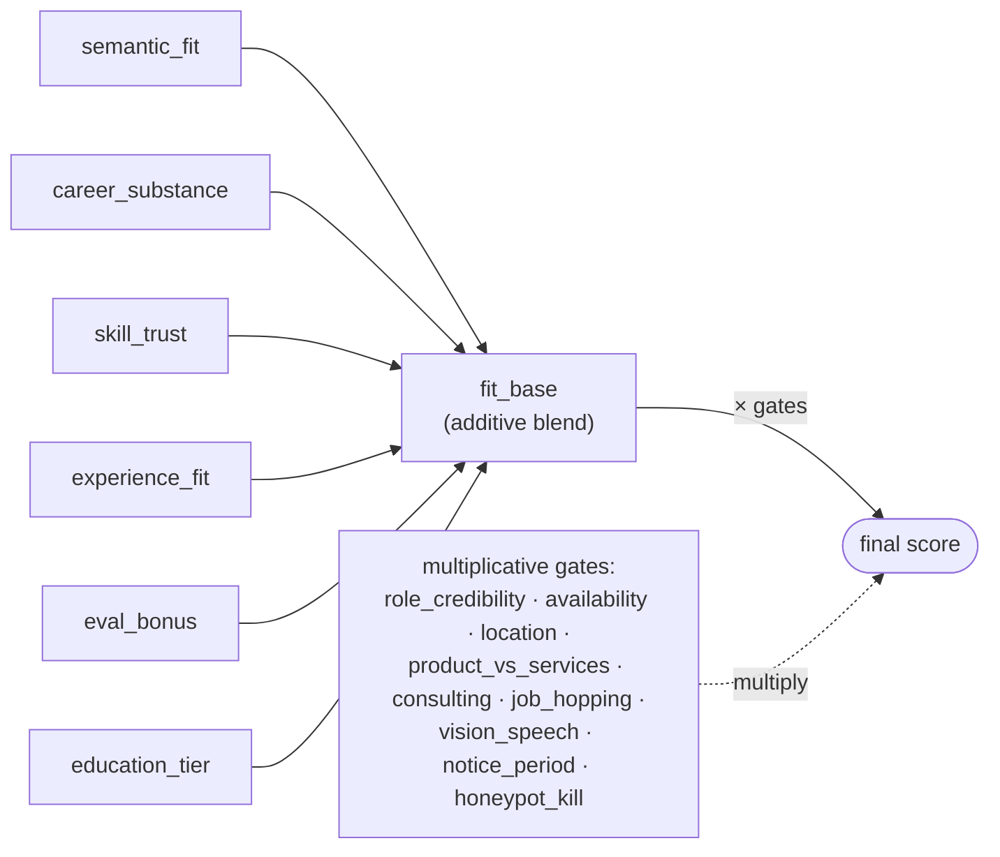

# Redrob Intelligent Candidate Discovery & Ranking

A hybrid (semantic + rule-based) ranker for the Redrob "Senior AI Engineer — Founding
Team" job description. It reads the 100,000-candidate pool and produces a top-100
shortlist a recruiter can trust — ranking candidates the way a careful recruiter would,
**not** by counting AI keywords.

## TL;DR — reproduce the submission

```bash
pip install -r requirements.txt

# 1) Pre-compute candidate embeddings ONCE (offline).
python precompute_embeddings.py --candidates ./candidates.jsonl

# 2) The ranking step — CPU-only, no network, well under 5 minutes.
python rank.py --candidates ./candidates.jsonl --out ./submission.csv

# 3) Validate format against the official validator.
python validate_submission.py ./submission.csv
```

`rank.py` is the single command that produces the CSV from the candidate file. If the
embedding cache (`artifacts/embeddings.npz`) is absent, `rank.py` still runs by
embedding inline (fine for small samples) or falling back to a dependency-free hashing
vectorizer — the pipeline never breaks.

## The problem, read correctly

The JD is deliberately adversarial. The dataset plants four trap families; the whole
game is reasoning about the **gap between what the JD says and what it means**:

| Trap                       | What it looks like                                                                              | How we defeat it                                                                                |
| -------------------------- | ----------------------------------------------------------------------------------------------- | ----------------------------------------------------------------------------------------------- |
| **Keyword stuffers**       | "Marketing Manager" with every AI keyword as a skill                                            | `role_credibility` gate — an off-target title with no engineering substance collapses the score |
| **Plain-language Tier-5s** | Never writes "RAG"/"Pinecone" but built a recsys at a product company                           | Semantic match + `career_substance` read the _job descriptions_, not just the skills list       |
| **Behavioral twins**       | Identical on paper, but one hasn't logged in for 6 months / 5% response rate                    | `availability` multiplier from Redrob behavioral signals                                        |
| **Honeypots (~80)**        | Subtly _impossible_ profiles (3 yrs exp but 61 career-months; "expert" in skills used 0 months) | `honeypot` impossibility detector drives them below rank 100                                    |

## Architecture

Two stages: an **additive base** scores how strong a real engineer is, then a chain of
**multiplicative gates** decides whether we believe it and can act on it.



**Additive base** — six signals, each in `[0, 1]`:

| Component          | Source signal                                          |
| ------------------ | ------------------------------------------------------ |
| `semantic_fit`     | career narrative vs. the JD-intent query (embeddings)  |
| `career_substance` | what the job-description text says they actually built |
| `skill_trust`      | relevance × endorsements × duration × Redrob assessment |
| `experience_fit`   | proximity to the JD's ideal 6–8 yr band                |
| `eval_bonus`       | mentions of NDCG / MRR / MAP / A-B testing             |
| `education_tier`   | institution tier                                       |

**Final score** — base, then gated:

```text
final = fit_base
        × role_credibility    × availability      × location
        × product_vs_services × consulting_penalty × job_hopping
        × vision_speech_penalty × notice_period   × honeypot_kill
```

- **Additive base** decides _how good_ a real engineer is.
- **Multiplicative gates** decide _whether we believe it and can act on it_.

This split is the core idea: keyword stuffers die on `role_credibility`, behavioral
twins separate on `availability`, plain-language Tier-5s survive because the semantic
and career-substance signals don't need the buzzwords, and honeypots are killed by the
impossibility detector. Every weight lives in [`ranker/jd.py`](ranker/jd.py) and is
auditable — see [METHODOLOGY.md](METHODOLOGY.md).

### Why a precomputed bi-encoder (and not per-candidate LLM calls)

The spec forbids hosted-LLM calls during ranking and imposes a 5-min / CPU-only / no-GPU
budget over 100K candidates — exactly the production constraint a real recruiting system
faces. We embed once offline with `all-MiniLM-L6-v2` (384-dim, CPU-friendly) and cache
the matrix; ranking is then cosine similarity plus cheap feature math. This is the
latency-quality tradeoff the JD says it wants to see.

## Repository layout

```
rank.py                     # main ranking step (produces submission.csv)
precompute_embeddings.py    # offline embedding cache builder
ranker/
  jd.py                     # JD intent model: vocabularies, skill ontology, weights
  features.py               # structured feature extraction (no model deps)
  honeypot.py               # impossibility / self-contradiction detector
  embeddings.py             # sentence-transformers w/ hashing-vectorizer fallback
  scoring.py                # additive base + multiplicative gates
  reasoning.py              # grounded, non-templated reasoning strings
  io_utils.py               # streaming jsonl / jsonl.gz reader
tests/test_ranker.py        # trap-behavior tests (honeypots, stuffers, twins, location)
app.py                      # Streamlit sandbox (ranks an uploaded sample)
METHODOLOGY.md              # ≤200-word approach summary + design rationale
submission_metadata.yaml    # portal metadata mirror
```

## Tests

```bash
python tests/test_ranker.py      # or: python -m pytest -q
```

The tests assert the behaviors the JD cares about: honeypots are caught, keyword
stuffers lose to real engineers, plain-language engineers beat off-title stuffers,
inactive behavioral twins lose, and location preference is respected.

## Compute profile

CPU-only, no network during ranking, < 16 GB RAM. Ranking step runs in well under
5 minutes on the full 100K pool once embeddings are precomputed.
